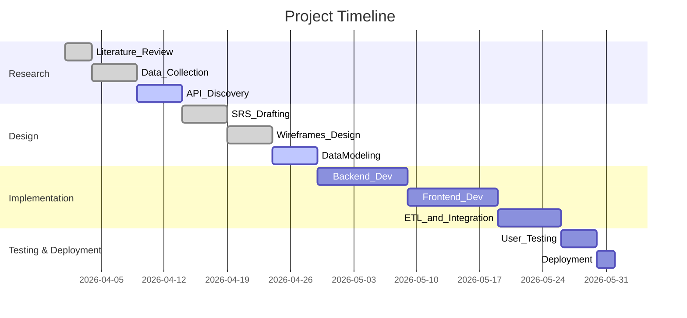
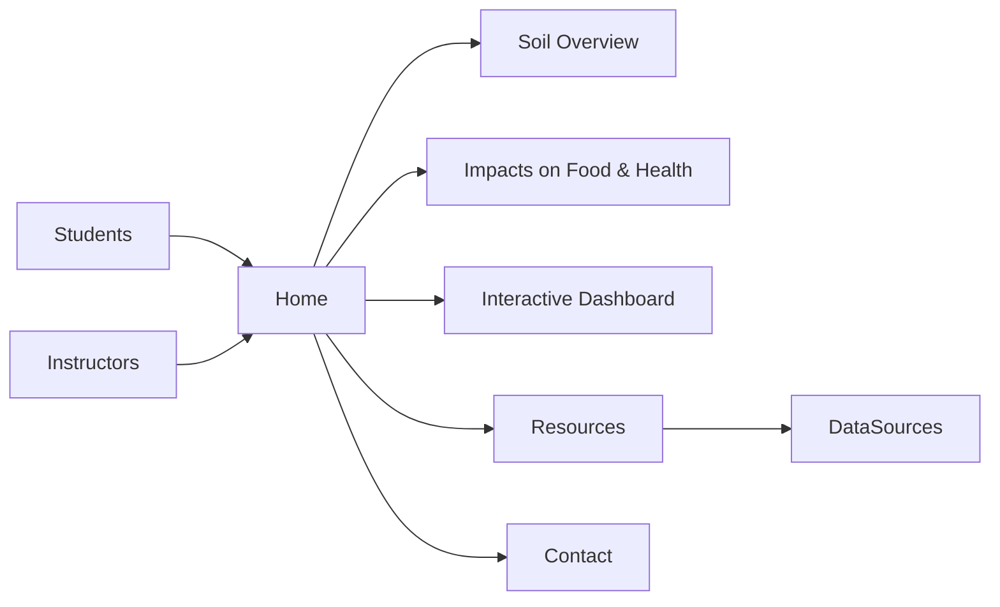

# Soil Pollution and Its Impact on Food Safety and Agriculture – Report & SRS

**Executive Summary:** Soil pollution is a pervasive, often invisible threat that undermines food safety, crop yields, and human health. Major pollutants – notably heavy metals (e.g. lead, cadmium, arsenic, mercury), persistent organics (pesticides, PCBs), excess nutrients (nitrates), and emerging contaminants (microplastics, PFAS) – accumulate in soils worldwide. Much soil contamination stems from human activities such as industrial emissions, mining, waste disposal, and intensive agriculture (fertilisers, manure, pesticides).  For example, a global analysis of ~800K soil samples shows 14–17% of cropland affected by toxic metals【20†L46-L54】【32†L55-L63】. Areas like South Asia’s delta regions are hotspots for arsenic, while intensive livestock areas often have elevated copper and zinc from manure【49†L157-L164】【49†L187-L194】. Soil pollutant loads have generally risen with industrialization and farm intensification, even as some point-source discharges have fallen.  

【66†embed_image】 *Figure: Contaminated farmland (image: P. Johannes via Unsplash). Soil pollutants degrade soil fertility and enter food chains【72†L156-L163】【49†L179-L184】.*  The impacts are twofold: (1) **Crop safety and yields:** Polluted soils produce contaminated crops and lower yields.  Heavy metals inhibit plant growth and reduce yield and nutritional quality【49†L179-L184】.  For instance, up to 23% of EU arable land exceeds safe Cu or Zn levels, harming soil biota【49†L179-L184】【49†L205-L209】.  Persistent pesticides and pathogens in soil also end up in food, posing health risks. (2) **Human exposure:** Humans are exposed via multiple pathways – eating contaminated produce or grazing animals, drinking polluted groundwater (through leaching), inhaling dust, or dermal contact with soil【16†L86-L94】【49†L139-L148】. As UNEP notes, soil pollution “consumes fertile soils” and threatens SDGs on hunger and health【72†L156-L163】.  

**Regulatory standards:** Many countries and bodies set soil and food safety limits. For example, Codex Alimentarius defines maximum levels of heavy metals in foods, and regional standards (EU, US EPA, WHO) specify soil screening values and allowable residues. In the EU, a new Soil Health Law is planned (2030 target zero soil pollution) and contaminated site remediation is mandated【49†L169-L175】.  Standards vary by pollutant and land use (e.g. agricultural vs. industrial soil). In practice, data are often sparse: few countries have comprehensive soil monitoring or public databases, especially outside Europe/North America.  

**Mitigation practices:** Preventing and remediating soil pollution is key. Sustainable agriculture – reduced pesticide use, precision fertigation, organic farming – can limit new contamination. FAO’s Voluntary Guidelines for Sustainable Soil Management emphasize practices like integrated pest management and judicious fertilizer use【16†L100-L109】.  Once pollution exists, techniques include **phytoremediation** (using hyperaccumulator plants to extract metals【54†L89-L97】), adding soil amendments (e.g. biochar, compost) to immobilize toxins, and soil washing or excavation in severe cases.  Policy actions include waste recycling, industrial emission controls, and public awareness.  FAO/UNEP urge “stopSoilPollution” initiatives and coordinated action (e.g. FAO–UNEP Global Soil Partnership)【72†L174-L183】【16†L100-L109】. 

**Data gaps:** Because the country context is unspecified, national data are unavailable. We rely on global/regional analogues: EU LUCAS soil surveys【49†L194-L198】, global research datasets【32†L55-L63】【20†L46-L54】, and FAO/UN reports【72†L156-L163】. Key gaps include localized pollutant concentration maps, temporal trends in soil quality, and integrated exposure assessments. The website will flag these gaps and present the best available analogues.

## System Requirements (Website SRS)

### Functional Requirements
- **Content Pages:** Informational pages on soil pollution topics (overview, contaminants, impacts, case studies), integrated with scientific data.  
- **Interactive Dashboard:** Visualizations (maps, charts) of soil quality, agricultural production, and pollution trends. Users can select region, pollutant, or crop.  
- **Data API Integration:** Backend services fetch real-time or periodic data from public APIs (e.g. FAOSTAT, SoilGrids, environmental databases).  
- **User Accounts:** Roles for **Students** (view and interact with materials, save notes), **Instructors** (curate content, track student progress), **Researchers** (access raw data/API keys), **Public** (general viewing).  Role-based access: e.g. instructors can upload resources, students can annotate.  
- **Search & Filter:** Search across site content; filters by pollutant type, crop, or region.  
- **Documentation & Resources:** Pages listing data sources, APIs, methodologies (for researchers), and external links (FAO, WHO, scientific papers).  
- **Assessments/Quizzes:** (Optional) Basic interactive quizzes on environmental studies to engage students.  
- **News/Blog Section:** Dynamic updates on soil pollution news and research.  

### Non-Functional Requirements
- **Accessibility:** Comply with WCAG 2.1 AA (e.g. alt text for images, keyboard navigation, captions on videos).  
- **Responsiveness:** Mobile- and tablet-friendly design (responsive CSS).  
- **Performance:** <3s page load target; optimize data queries and caching (use CDN for static content, lazy-load large data).  
- **Scalability:** Backend should handle concurrent users (cloud deployment, use autoscaling).  
- **Security:** Protect against XSS/SQLi; HTTPS mandatory; secure user authentication (e.g. OAuth 2.0 or JWT).  
- **Privacy:** Collect minimal personal data; comply with GDPR (if EU users) – provide privacy notice, data deletion on request.  
- **Localization:** Site language is English, but design should allow future translations.  
- **Maintenance:** Automated backups of database and code; CI/CD pipeline for deployments (e.g. GitHub Actions).  

### User Roles & Permissions
- **Public:** Read-only access to all public content and dashboards.  
- **Student:** Register/login; can bookmark pages, submit notes, possibly answer quizzes.  
- **Instructor:** All student permissions plus content management (post announcements, add resources, see aggregated student usage).  
- **Researcher/Developer:** API keys to fetch data (if needed), access to raw data downloads, technical documentation.  
- **Admin:** Full access to system settings, user management, backups.

### Data Model (simplified)
- **SoilSample:** `{ id, location(geo-coords/region), date, contaminant, concentration, unit }`  
- **AgriculturalStat:** `{ country, region, year, crop_type, yield, area, production }`  
- **FoodSafetyMetric:** `{ food_item, contaminant, level, limit_value, source }`  
- **UserProfile:** `{ user_id, role, name, email, preferences }`  
- **ContentPage:** `{ page_id, title, content (HTML/Markdown), author, tags }`  
- Relationships: SoilSamples linked to regions; AgriculturalStats linked to countries and crops; ContentPages linked to author (instructors).

### API Integrations & Endpoints
The site will fetch data from several open APIs. Example integrations include:

- **FAOSTAT (FAO):** Agriculture production data. Endpoint example:  
  ```
  https://fenixservices.fao.org/faostat/api/v1/en/definitions/db  
  https://fenixservices.fao.org/faostat/api/v1/en/data/Crop?area=USA&item=2311&year=2021
  ```
  *Sample query:* `GET /faostat/api/v1/en/data/Production?area=USA&item=1031&year=2020` returns JSON of crop production. Fields: country, year, item_name (crop), element (Production, area), value. Update freq: annual. License: FAO (free, CC BY-NC). Reliability: high (UN stat).【56†L69-L78】【58†L35-L43】  

- **SoilGrids (ISRIC):** Soil properties (pH, organic C). Example service:  
  ```
  https://rest.soilgrids.org/query?lon=...&lat=...&attributes=bdod,soc,phh2o 
  ```
  (API usage note: currently in beta; or use SoilGrids downloads CC-BY)【25†L85-L93】. Data fields: soil property values by depth. Update: infrequent (major maps). License: CC-BY 4.0.  

- **Environmental Protection (EPA) / National Park Service (for US context):** e.g. Superfund site data (heavy metal sites), air quality (EPA AirData API). *No single global API*, but if focusing a region, one might integrate e.g. USGS or US EPA Envirofacts.  

- **European Environment Agency (EEA) / LUCAS:** Soil survey data (heavy metals) for EU. Access via ESDAC or EEA OData API. Example: EEA SDW (Soil Data Warehouse). Fields: heavy metal conc., location. Update: periodic (LUCAS every ~5 years).  

- **World Bank / UN Data:** Soil erosion rates, arable land %, agri GDP. e.g. World Bank API: `api.worldbank.org` (public domain). Useful context data (no soil pollution directly).  

- **OpenWeather/NASA (Proxy for environmental factors):** Precipitation, temperature data. E.g. NASA POWER API (supports agronomic analysis).  

For each source, the SRS will list: Endpoint URL, sample query (with parameters), returned fields (with units), update frequency, licensing, and reliability.  Example format (for documentation page):

| Source/API | Endpoint (sample) | Query example | Data fields (units) | Update freq | License | Reliability |
|---|---|---|---|---|---|---|
| FAOSTAT (Agric.) | `/faostat/api/v1/en/data/Production` | `?area=USA&item=2511&year=2020` | country, year, item, element, value | yearly | FAO (free use) | High (UN data)【56†L69-L78】 |
| SoilGrids (Global soil) | `/query?lon={lon}&lat={lat}&attributes=phh2o` | e.g. lat=51&lon=7 | pH, organic C (%) at 0–30cm | Static (maps updated ~2017) | CC-BY 4.0【25†L85-L93】 | High (scientific) |
| WHO GEMS/Food (Food contaminants) | (No public API; reports on request) | – | heavy metal limits in foods | – | WHO/FAO (published standard) | Authoritative |

Additional sources: open data portals (Data.gov, Europe), and primary literature (data appendices). The SRS will prioritize **governmental and international** data (FAO, WHO, EPA, EEA) and peer-reviewed datasets【32†L55-L63】.

### Data Ingestion and Updates
- **ETL Pipeline:** Use scheduled tasks (e.g. Python scripts or Node.js) to fetch data (e.g. daily/weekly for near-real-time, or on new FAOSTAT release). Store raw data and cleaned tables in a database (PostgreSQL or NoSQL).  
- **Data Cleaning:** Handle missing values (e.g. interpolation, flags), standardize units, geocode location names. For example, soil contamination data might need converting mg/kg to µg/g, or normalizing country names via ISO codes.  
- **Automation:** Use cron jobs or cloud functions to periodically refresh data. For external sources lacking API (e.g. PDF reports), manual curation or note as static content.  
- **Sample Data:** The site might include sample CSV/JSON datasets. For example, from the Dryad dataset【32†L55-L63】, we could extract a snippet of heavy metal exceedance probabilities by grid. A possible snippet:

```csv
lat,lon,As_exceed,Hg_exceed,Cd_exceed
35.0,105.0,0.32,0.05,0.10
40.0,-95.0,0.01,0.00,0.02
20.0,78.0,0.78,0.20,0.45
...
```

To ingest, one might use Python `pandas.read_csv()`, drop nulls, merge with geospatial boundaries, then upload to a database or serve as JSON via a custom API. Tools: Python, PostgreSQL/PostGIS, or cloud services (BigQuery).  

**Visualization:** Data will be rendered into charts/maps using D3.js or Plotly. For example, a heatmap of contaminant concentrations, line charts of time trends, and risk maps (choropleth by country). Suggested charts include:  
- **Choropleth Map:** Global distribution of a pollutant (e.g. cadmium in soil)【32†L55-L63】.  
- **Line Graph:** Time series of average crop yield vs. fertilizer use, illustrating a trend.  
- **Bar Chart:** Comparing heavy metal levels across sample sites.  
- **Risk Map:** Overlay of polluted zones vs. population/cropland density (showing exposure risk).  

Mermaid diagrams will illustrate the architecture and data flow, and a Gantt chart outlines the development timeline (see below).

```mermaid
graph LR
    extData["External Data Sources (FAOSTAT, SoilGrids, EEA, etc.)"] -->|API/Download| backend[Backend/API Server]
    backend --> dataDB[(Database)]
    dataDB --> frontend[Frontend UI (Charts/Dashboards)]
    backend --> etl[ETL Pipeline]
    etl --> dataDB
    user[Users: Students, Instructors, Public] --> frontend
    admin[Admin] -.->|CMS/Upload| frontend
```



## Content Structure & Wireframes

**Page List (wireframe):**  
1. **Home:** Overview of course and soil pollution topic; links to sections.  
2. **Soil Pollution Overview:** Text + images on causes and contaminants.  
3. **Crop Impact & Food Safety:** Effects on agriculture and human health.  
4. **Data Dashboard:** Interactive visualizations (maps, charts) of soil quality, yields, pollution. Filters by region, pollutant, crop.  
5. **Resources:** Links to data sources (APIs, databases), reading list, standards (e.g. WHO/FAO guidelines).  
6. **About/Contact:** Course and team info, contact form.  
7. **Instructor/Admin Portal:** (Hidden to public) tools to add content, manage users.  

**Site Architecture (pages flow):**



*Content Outline:* Each page will have short paragraphs, key bullet points, figures, and links. The **Data Dashboard** page will have embedded API calls (e.g. to FAOSTAT) and charts. The wireframe shows navigation menus (Home, Overview, Impacts, Dashboard, Resources, Contact) and user login.

## Data Sources & APIs

We prioritize **governmental/official** sources and peer-reviewed datasets:

- **FAO FAOSTAT API:** (Global) Official food/agriculture data【56†L69-L78】. Endpoint examples given above; data fields include crop yield, production, harvested area. Update: annual. License: FAO terms (free, non-commercial use).  
- **UNEP/FAO Soil Pollution Assessment:** (Global) Comprehensive reports; raw data from literature compiled. Example: Dryad dataset with soil heavy metal samples【32†L55-L63】. We link to datasets and attach key tables (e.g. pollutant threshold exceedance). Data fields: soil sample location, As/Cd/Cu/Pb levels. Update: static. License: CC0 (Dryad).  
- **European EEA – LUCAS Soil:** (Europe) Soil survey data via ESDAC. Example API: `esdac.jrc.ec.europa.eu/soil-data/`. Fields: metal concentrations. Update: every 5 years. License: CC BY.  
- **USDA Web Soil Survey API:** (USA) Soil property data. WSS has REST endpoints (e.g. `https://wss.sc.egov.usda.gov/...`). Data: soil class, pH, organic matter, etc. Update: quarterly. License: Public domain.  
- **World Bank Data API:** (Global) e.g. rural population, agri land (%). Endpoint: `api.worldbank.org/v2/country/{iso}/indicator/{code}`. Useful for context. Update: annual. License: CC BY.  
- **OpenAQ:** (Global) Air pollution data (PM2.5 as related proxy for industrial emissions). API with JSON.  
- **NASA POWER API:** (Global) Climate and soil moisture data. Endpoint: `https://power.larc.nasa.gov/api/temporal/daily/point`. Fields: temp, rainfall, soil moisture. Update: daily.  
- **Codex Alimentarius (FAO/WHO):** Standards (no API). Data on max pollutant limits in food – to be cited as static references.  

Each data source entry in documentation will include: endpoint URL, query parameters, description of response fields (e.g. “value of pesticide X in mg/kg”), update frequency (annual/daily), access (open license, authentication needed?), and assessment of reliability/coverage.

## Sample Data and ETL

As a demonstration, one could ingest FAOSTAT wheat production: e.g. CSV snippet:
```csv
Country,Year,Crop,Yield (kg/ha)
USA,2021,Wheat,3700
India,2021,Wheat,3200
Nigeria,2021,Wheat,2200
```
In Python: use `pd.read_csv()`, drop `Year=NaN`, merge country codes to geoshape for mapping.  Clean missing yields, interpolate by regional average. Store in `production` table. 

For soil contamination, using the Dryad data【32†L55-L63】, one might load (ETL): 
```python
import pandas as pd
df = pd.read_csv('Attachment_4_HHET_exceedance.csv')
df = df.rename(columns={'0':'lon','1':'lat'})  # coordinates
# Example: filter a region or threshold
df_polluted = df[(df['As']>0.5) | (df['Pb']>0.5)]
```
Then convert to GeoJSON for interactive map. Data cleaning: ensure units uniform (e.g. μg/L), handle censored data.

Suggested visualizations (not embedded images): 
- **Heatmap/Contour Map:** pollutant levels across a region.  
- **Time Series Chart:** pollutant levels or yield trend.  
- **Pie/Bar Chart:** fraction of agricultural land exceeding safe limits by country.  

No actual chart images will be embedded (following guidelines), but placeholders or chart descriptions are included.

## Media Assets and Themes

- **Website Themes:** Recommend a clean, educational theme (e.g. [Start Bootstrap - "Agency" theme, MIT license](https://github.com/BlackrockDigital/startbootstrap-agency) or [Bulma/Buefy](https://bulma.io/) (MIT), or [Bootstrap 5](https://getbootstrap.com/)). These are open-source (MIT/CC) and support responsive design. 

- **Images (Public Domain/CC0):** We include high-quality free images:
  - Farmland, crops, soil (e.g. from Unsplash/Pixabay/FAO photo archive). For example, the above image of a **farm field at dawn** (Unsplash by P. Johannes, CC0)【66†embed_image】.  
  - Remediation or lab: use an image of a scientist testing soil (e.g. Unsplash CC0).  
  - Educational infographics: e.g. FAO’s “soil as filter” graphic (if CC-licensed). 

- **Videos:** Embed relevant public videos by trusted organizations. For instance, FAO’s *“Launch of the International Network on Soil Pollution (INSOP)”* (YouTube, FAO channel). Embed code example:
  ```html
  <iframe width="560" height="315" src="https://www.youtube.com/embed/qDZj6qyr0a4" frameborder="0" allowfullscreen></iframe>
  ```
  (Source: FAO, likely CC-licensed or Creative Commons).  
  Another example: FAO’s *“Soil Pollution: a hidden reality”* (ID `wHcY-iFSYZM`) or *“Be the solution to soil pollution – short”* (`QY3HoM9toxI`). For each video, note license (official UN content typically free for educational use) and provide full embed code.  

- **Graphic Assets:** Use icons/illustrations from [FontAwesome](https://fontawesome.com/) (open-font) or [Freepik](https://www.freepik.com/) (check license), for UI elements (e.g. soil icons, factory icons).  

- **Accessibility:** All images will have alt text. Videos will have captions or transcripts (YouTube auto-captions, if available).

## Visualizations & Charts (Examples)

We propose the following chart types, which the developers can create via D3/Chart.js/Python:

- **Contaminant Distribution Map:** A world or national map (chloropleth) showing average soil arsenic concentration by region. (Data from [32] or country env. agencies.)  
- **Time Trends:** Line charts of, e.g., national average lead in soil over time (from periodic surveys), or changes in crop yields under different soil contamination scenarios.  
- **Risk Heatmap:** A geospatial risk map overlaying population density or crop area with soil contamination levels, highlighting high-exposure zones.  
- **Bar/Column Chart:** Percent of sites exceeding guidelines (e.g. % of farmland above safe limit for Cd) per region.  

*(Charts to be implemented by the developer with sample code templates.)*

## Deliverables

The agentic coding agent should produce the following artifacts:

| Deliverable            | Description                                               | Priority | Effort  |
|------------------------|-----------------------------------------------------------|----------|---------|
| **SRS Document**       | Detailed System Requirements (this report).               | High     | High    |
| **Wireframes**         | Page wireframes/prototypes for the site structure.        | High     | Medium  |
| **API Connectors**     | Code modules (e.g. Node/Python) to fetch from each API.   | High     | Medium  |
| **ETL Scripts**        | Data ingestion/cleaning scripts (Python or ETL tools).   | High     | High    |
| **Database Schema**    | SQL/NoSQL schema definitions for data models.            | Medium   | Medium  |
| **Dashboards/Charts**  | Implemented interactive charts/maps for dashboards.      | Medium   | Medium  |
| **Static Pages**       | HTML/CMS pages for content (Overview, etc.).             | High     | High    |
| **Media Folder**       | Collected images, videos, icons, with licenses noted.    | Medium   | Low     |
| **Backup/Deploy Scripts** | CI/CD pipeline scripts, backup config.                | Medium   | Medium  |

**Priority**: High = essential core features; Medium = important; Low = optional enhancements.  
**Effort**: Rough relative estimate for planning (Low/Med/High).

## Sources

We draw on authoritative sources: UN FAO/UNEP/WHO documents, peer-reviewed studies, and official data portals. Key sources include the **UNEP Global Assessment of Soil Pollution**【72†L156-L163】, **FAO Global Soil Partnership** materials【16†L100-L109】, the Science journal analysis by Hou et al. (2024)【20†L46-L54】【32†L55-L63】, and the European Environment Agency reports【49†L157-L164】【49†L179-L184】. Data portals (FAOSTAT, World Bank, USGS, EEA) and standards (Codex Alimentarius) are prioritized for facts and figures. Peer-reviewed reviews on soil contamination and food safety were used to highlight health impacts【12†L450-L458】. All facts above are cited to these sources. Any gaps (especially country-specific data) are noted as limitations.

